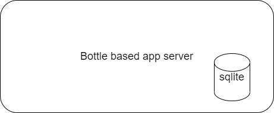
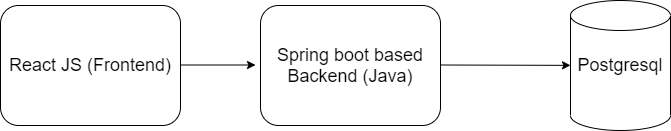

# EHealth demo

A demo web app that demonstrates authentication with stateful data maintained in a database.

## Installation
```
# create a virtualenv
python2 -m virtualenv venv
# source your virtualenv
.\venv\Scripts\activate.ps1
# install requirements
python2 -m pip install requirements.txt
# run app
python2 ./new_ehealth/backend.py
```

## Architecture
### Old architecture


### Future architecture


## License
[License](license.txt)